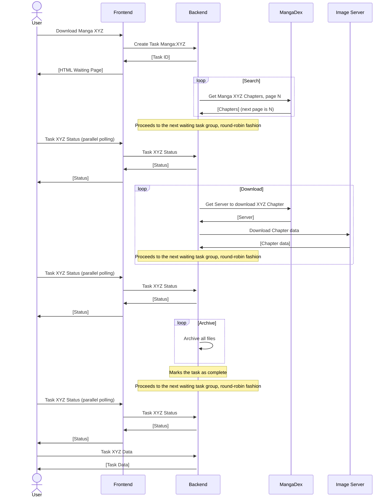

# MangaDex.zip
Easily download Manga and Chapters from [MangaDex](https://mangadex.org), using a cursed solution to everyone's problems: the `.zip` TLD.  

Thanks [Tristan](https://gitlab.com/Tristan___) for your bad ideas.

***

# Usage
Basic downloads can be achieved by replacing the `.org` TLD by the `.zip` one.  
Here's an example: `https://mangadex.org/title/b9797c5b-642e-44d9-ac40-8b31b9ae110a/tsuki-ga-kirei-desu-ne` :arrow_forward: `https://mangadex.zip/title/b9797c5b-642e-44d9-ac40-8b31b9ae110a/tsuki-ga-kirei-desu-ne`  

# Advanced Usage
There are multiple query parameters available to change download settings.  
You can use the following parameters when downloading from MangaDex.zip:
- `light=1` switches from original to slimmed down pages. This usually speeds up the download process and takes less space on your device.

Additionally, you can use the following parameters when downloading Manga:
- `lang=X` changes the language used when searching for Chapters. (e.g. `lang=fr`)
- `title=1` automatically appends the Chapter's title if present.
- `group=X` selects primary Groups when downloading Chapters, allowing you to prioritize scanlation Groups. This parameter can be repeated, and Chapters will be selected in a 'first match' fashion. (e.g. `group=672ff295-0996-4367-b529-cdf92ff5db7d`)
- `group_only=1` modifies the behavior of the `group=X` parameter by explicitly not downloading Chapters that aren't matching selected Groups.
- `start=X` trims the Chapter list to only download Chapters greater than or equal to a specific number. (e.g. `start=15`)  
  `end=X` trims the Chapter list to only download Chapters less than or equal to a specific number. (e.g. `end=30`)  
  Please note that because of MangaDex's metadata inconsistency, it is not possible to precisely trim to specific volumes.

Please remember that only the first query parameter should start with an `?`, while subsequent parameters should start with a `&`.

# How does this work?
## General working schema
Here's a Mermaid Sequence Diagram to help you understand how the MangaDex.zip works:



## Fair-Queue System
To prevent someone from blocking the server with multiple large titles, MangaDex.zip uses a download queue system.
The queue is shared among all users on a single worker.  
To ensure fairness, Chapters are downloaded one by one, and are processed in a round-robin fashion. 
A user with 30 active tasks will have the same priority as another user with only 5 tasks and will be processed equally.  
After each completed task, the worker will switch to the next user, instead of switching to the user's next task.

## A note about threads
As MangaDex doesn't allow us to have more requests per a given timeframe than other users, having more threads to download multiple Chapters at once wouldn't give any benefit.
Even worse, this could lead to errors due to MD's ratelimiting.

# For developers
MangaDex.zip offers [an API](https://mangadex.zip/redoc) to start new download tasks and view their status.  
Starting a task is as simple as sending an HTTP request. You then need to regularly (e.g. every 2.5 seconds) check the task status endpoint.  
Once finished, the task's status endpoint will be populated with a URL where the task can be retrieved.

***

# Deployment
The same package is used for both the Frontend and the Backend. This allows for convenient upgrades to the entire stack.

Here's a simple set of instructions to deploy the client: *(instructions are designed to work on any \*NIX system)*
1. Clone the repository to your local machine
2. Edit the configuration to your liking (values are self-explanatory but are explained below) -- The configuration defines the server's operating mode (Frontend, Backend or Both)
3. Create a virtual environment with `python3 -m venv venv`
4. Install the requirements to your environment with `venv/bin/pip install -r requirements.txt`
5. Install Uvicorn to your environment with `venv/bin/pip install uvicorn`
6. Use this command to start the frontend: `venv/bin/uvicorn MangaDexZip.app:app --port 8080`

You can also use a service manager like systemd to start MangaDex.zip in the background:
```service
[Unit]
Description=MangaDex.zip Worker
After=network-online.target
Wants=network-online.target
Requires=network-online.target

[Service]
WorkingDirectory=/home/mdzip-worker
ExecStart=/home/mdzip-worker/venv/bin/uvicorn MangaDexZip.app:app --port 8080

# The following are required to stop the service when running as a Worker:
KillMode=process
KillSignal=SIGKILL
SendSIGKILL=yes

[Install]
WantedBy=multi-user.target
```

## Reverse-proxying
You can use a reverse proxy in front of Uvicorn in order to do further filtering. MangaDex.zip does not include any bot prevention service.  
You may want to check [Uvicorn's HTTP settings](https://www.uvicorn.org/settings/#http) to ensure that MangaDex.zip receives the correct client IP, and not your proxy's address.  
If the worker fails to identify the IP address, the Fair Queue system will not work properly.

# Configuration
The server loads a single `config.json` file at the root of your working directory. Here's a brief description of each config option:

- `additional_configurations`: An array of paths to other configuration files. Other configuration files should reference config keys with a dot-notation, e.g.:
  ```json
  {
      "frontend.backends.example.token": "some_token",
      "backend.auth_token": "some_other_token",
      "admin.auth_token": "some_even_more_complex_token"
  }
  ```
- `frontend`:
  - `enabled`: Boolean, defines whether to load the Frontend router and its capabilities.
  - `backends`: Object of objects, referencing backends. Here's an example backend:
    - `default`:
      - `url`: String, the backend (worker)'s URL. This address is used for internal communication between the frontend and the backend.
      - `external_url`: String (nullable), the URL presented to users when contacting the worker from the outside. If null, the worker's internal URL will be used.
      - `token`: String (nullable), the worker's token. If null, authentication won't be performed during requests.
      - `priority`: Integer, used to decide which worker to use when multiple workers have the lowest number of active groups.
      - `timeout`: Integer, number of seconds before aborting the connection. *This can also be a float.*
      - `proxy_data`: Boolean, whether to proxy task data from the worker. Proxying should only be used when a direct connection isn't available from the Internet to the worker.
      - `skip_ready_check`: Boolean, whether to skip checking the worker's ready status.
      - `maintenance`: Boolean, whether to ignore this worker when selecting the less busy worker. This still allows retrieving task info and task data.
  - `task_cache_ttl`: Integer, how long (in seconds) should a task be tied to a worker.
- `backend`:
  - `enabled`: Boolean, defines whether to load the Backend router and its capabilities.
  - `auth_token`: String (nullable), passphrase to restrict access to backend endpoints. Should be set in exposed environments.
  - `hide_from_openapi`: Boolean, hides backend routes from the OpenAPI spec and from the documentation.
  - `always_allow_retrieve`: Boolean, allows retrieving task data without an authentication token.
  - `temp_path`: String (path, absolute or relative), where to store task temporary data (downloads, archives).
  - `scheduler_empty_wait`: Integer, how long (in seconds) to sleep before checking for new tasks. It is not recommended to set that to zero. *This can also be a float.*
  - `task_ttl`: Integer, how long (in seconds) to keep a task's data. This affects all tasks, including running tasks. Tasks that are still running will be wiped (this prevents endless tasks that may be stuck in a loop).
  - `task_empty_ttl`: Integer, how long (in seconds) to keep an empty task's metadata. This only affects created tasks that haven't been populated with actions (this should never happen if not manipulating the TaskScheduler manually).
  - `cleanup_interval`: Integer, internal frequency at which tasks are checked if they're past their TTL or empty TTL.
  - `limits`: *Limits affect the ready status, which should be considered by the frontend. They are not enforced unless the `enforce_limits` option is set to true.*
    - `max_groups`: Integer, maximum number of groups allowed simultaneously. *Please note that this does not take the current group into account when submitting a new task. This is more of a hard limit.*
    - `max_active_groups`: Integer, maximum number of active (running) groups allowed simultaneously. *Please note that this does not take the current group into account when submitting a new task. This is more of a hard limit.*
    - `max_tasks`: Integer, maximum number of tasks allowed simultaneously.
    - `max_active_tasks`: Integer, maximum number of active (running) tasks allowed simultaneously.
    - `max_worker_space_mb`: Integer, maximum allowed space (in megabytes) to be used by the worker. *Please note that this will compute space used by all tasks. It is recommended to use a dedicated partition and use `max_used_space_mb` instead.*
    - `max_worker_space_pct`: Integer, maximum allowed space (in percent) to be used by the worker. *Please note that this will compute space used by all tasks. It is recommended to use a dedicated partition and use `max_used_space_pct` instead.*
    - `max_used_space_mb`: Integer, maximum allowed space (in megabytes) to be used on the worker's partition.
    - `max_used_space_pct`: Integer, maximum allowed space (in percent) to be used on the worker's partition.
    - `min_free_space_mb`: Integer, minimum required space (in megabytes) to be free on the worker's partition.
    - `mun_free_space_pct`: Integer, minimum required space (in percent) to be free on the worker's partition.
  - `enforce_limits`: Boolean, whether to enforce above limits when creating new tasks on the worker.
- `admin`:
  - `enabled`: Boolean, defines whether to load the Admin router and its capabilities.
  - `auth_token`: String (nullable), passphrase to restrict access to admin endpoints. Should be set in exposed environments.
  - `hide_from_openapi`: Boolean, hides admin routes from the OpenAPI spec and from the documentation.

***

# Contributing
If someone could provide a better alternative to the ugly 'wait.html' JavaScript, then yeah, why not. Otherwise, please do not waste your time on this project.

# Somewhat legal disclaimer
Just kidding.  
We're not affiliated with MangaDex by any means. You can always join their [Discord server](https://discord.gg/mangadex).