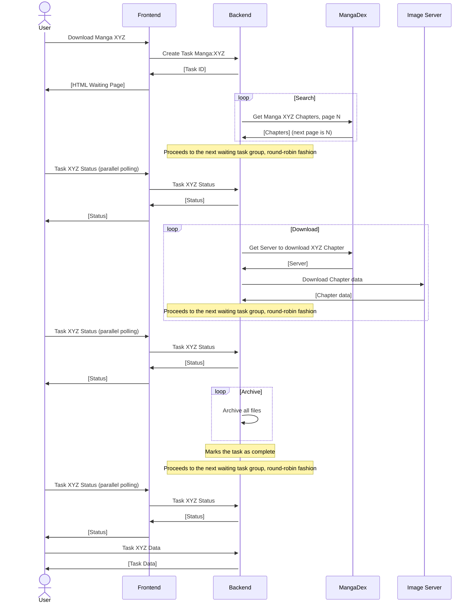

# MangaDex.zip
Easily download Manga and Chapters from [MangaDex](https://mangadex.org), using a cursed solution to everyone's problems: the `.zip` TLD.  

Thanks [Tristan](https://gitlab.com/Tristan___) for your bad ideas.

# Usage
Basic downloads can be achieved by replacing the `.org` TLD by the `.zip` one.  
Here's an example: `https://mangadex.org/title/b9797c5b-642e-44d9-ac40-8b31b9ae110a/tsuki-ga-kirei-desu-ne` :arrow_forward: `https://mangadex.zip/title/b9797c5b-642e-44d9-ac40-8b31b9ae110a/tsuki-ga-kirei-desu-ne`  

# Advanced Usage
There are multiple query parameters available to change download settings.  
You can use the following parameters when downloading from MangaDex.zip:
- `light=1` switches from original to slimmed down pages. This usually speeds up the download process and takes less space on your device.

Additionally, you can use the following parameters when downloading Manga:
- `lang=X` changes the language used when searching for Chapters. (e.g. `lang=fr`)
- `title=1` automatically appends the Chapter's title if present.
- `group=X` selects primary Groups when downloading Chapters, allowing you to prioritize scanlation Groups. This parameter can be repeated, and Chapters will be selected in a 'first match' fashion. (e.g. `group=672ff295-0996-4367-b529-cdf92ff5db7d`)
- `group_only=1` modifies the behavior of the `group=X` parameter by explicitly not downloading Chapters that aren't matching selected Groups.
- `start=X` trims the Chapter list to only download Chapters greater than or equal to a specific number. (e.g. `start=15`)  
  `end=X` trims the Chapter list to only download Chapters less than or equal to a specific number. (e.g. `end=30`)  
  Please note that because of MangaDex's metadata inconsistency, it is not possible to precisely trim to specific volumes.

Please remember that only the first query parameter should start with an `?`, while subsequent parameters should start with a `&`.

# How does this work?
## General working schema
Here's a Mermaid Sequence Diagram to help you understand how the MangaDex.zip works:

## Fair-Queue System
To prevent someone from blocking the server with multiple large titles, MangaDex.zip uses a download queue system.
The queue is shared among all users on a single worker.  
To ensure fairness, Chapters are downloaded one by one, and are processed in a round-robin fashion. 
A user with 30 active tasks will have the same priority as another user with only 5 tasks and will be processed equally.  
After each completed task, the worker will switch to the next user, instead of switching to the user's next task.

## A note about threads
As MangaDex doesn't allow us to have more requests per a given timeframe than other users, having more threads to download multiple Chapters at once wouldn't give any benefit.
Even worse, this could lead to errors due to MD's ratelimiting.

# For developers
MangaDex.zip offers [an API](https://mangadex.zip/redoc) to start new download tasks and view their status.  
Starting a task is as simple as sending an HTTP request. You then need to regularly (e.g. every 2.5 seconds) check the task status endpoint.  
Once finished, the task's status endpoint will be populated with a URL where the task can be retrieved.

# Contributing
If someone could provide a better alternative to the ugly 'wait.html' JavaScript, then yeah, why not. Otherwise, please do not waste your time on this project.

# Somewhat legal disclaimer
Just kidding.  
We're not affiliated with MangaDex by any means. You can always join their [Discord server](https://discord.gg/mangadex).